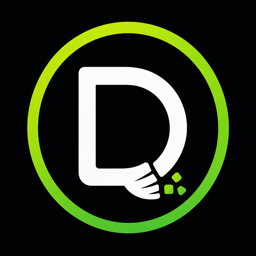

#  Debris


[](LICENSE)

Debris finds what is left of apps you no longer have, uninstalls apps together with everything
they own, and clears caches and developer junk. It shows the list first, explains why each file
is on it, and moves things to the Trash rather than deleting them, so a wrong guess is one drag
away from undone.

Download the latest disk image from the
[releases page](https://github.com/mews-se/debris/releases/latest), open it and drag Debris to
Applications. The app is signed with a Developer ID and notarized, so Gatekeeper lets it run
without a detour. It needs macOS 15 or later. More at
[debris.martinstockzell.se](https://debris.martinstockzell.se/).

## What it does

**Leftovers** compares every entry in the folders where apps keep their state (Application
Support, Caches, Preferences, Containers, Group Containers, HTTP storages, WebKit data, launch
agents and daemons, helper tools, kernel and audio extensions, the home folder's dotfiles and a
few more) against the apps, helpers, extensions, command-line tools and Homebrew packages that
are actually installed. Whatever has no owner left is listed, grouped by the app it came from,
with a size, a last-modified date and a confidence:

- *Likely leftover*: no installed app, helper or package matches the file at all.
- *Possibly leftover*: no exact match, but the same vendor still has other apps installed.
  Microsoft's updater daemon after Office is gone looks like this.
- *Unclear*: a plain name with no identifier, or a container whose owner cannot be read.

The confidence filter in the toolbar starts at Likely. Files owned by the system, such as launch
daemons and helper tools, are marked with a lock: they go to the Trash too, behind one
administrator prompt per batch. Staged system extensions are listed but cannot be moved while
System Integrity Protection is on, and the list says so.

**Uninstall** lists the installed apps. Pick one and Debris shows the app bundle together with
everything it can tie to it: containers, group containers, preferences, caches, HTTP storages,
WebKit data, saved state, launch agents, helper tools and dotfiles, each with the reason it is on
the list. Ownership uses the same signals as the Leftovers scan turned around: bundle identifiers
including embedded helpers, the team and app groups from the code signature, launchd jobs that
point into the bundle, and names. Anything shared with another installed app stays, so removing
Word does not touch what Excel still uses. A running app is quit first. Package receipts are
listed with the rest and go to the Trash with it, which is what `pkgutil --forget` would do.

**Clean** removes caches, logs, developer artifacts and installer files, each behind a rule that
says what the files are and why they are safe to remove: app caches and logs (only for apps that
are still installed; the rest is a leftover), Xcode's build folders, device support files and
archives, unavailable simulators, the download caches of Homebrew, npm, Yarn, pip, Swift Package
Manager, CocoaPods, Cargo, Gradle, Maven and Go, and disk images or installer packages sitting in
Downloads. Everything is listed with its size first. Archives, device support files and
installers are never selected for you, and neither is the cache of an app that is running.

## What it does not do

It does not tune, speed up or monitor anything, and it never deletes on its own. Everything goes
through the list and the Trash, including what needed an administrator to move: those items are
handed over to your user on the way, so emptying the Trash needs no second password.

## Full Disk Access

macOS hides parts of the Library from every app until you grant it Full Disk Access in System
Settings. Without it Debris cannot see inside sandboxed containers, Mail, Safari or cookies, and
cannot move container leftovers to the Trash. The app tells you when that is the case and takes
you to the right setting.

## Building

```
brew install xcodegen
xcodegen generate
open Debris.xcodeproj
```

The Xcode project is generated from `project.yml` and not committed. The scanning and
classification live in the Swift package under `Packages/DebrisKit`, which also builds a small
command line tool:

```
cd Packages/DebrisKit
swift run debris                        # scan and print what the app would list
swift run debris --all                  # include the unclear cases
swift run debris --uninstall "App Name" # what the Uninstall module would list
swift run debris --clean                # what the Clean rules find
swift test
```

Releases are notarized Developer ID builds made with `scripts/release.sh`, see
[CONTRIBUTING](CONTRIBUTING.md).

macOS 15 or later. Debris is not sandboxed and will not be on the App Store: the whole point is
to reach files a sandboxed app cannot.

## Licence

MIT, see [LICENSE](LICENSE).
